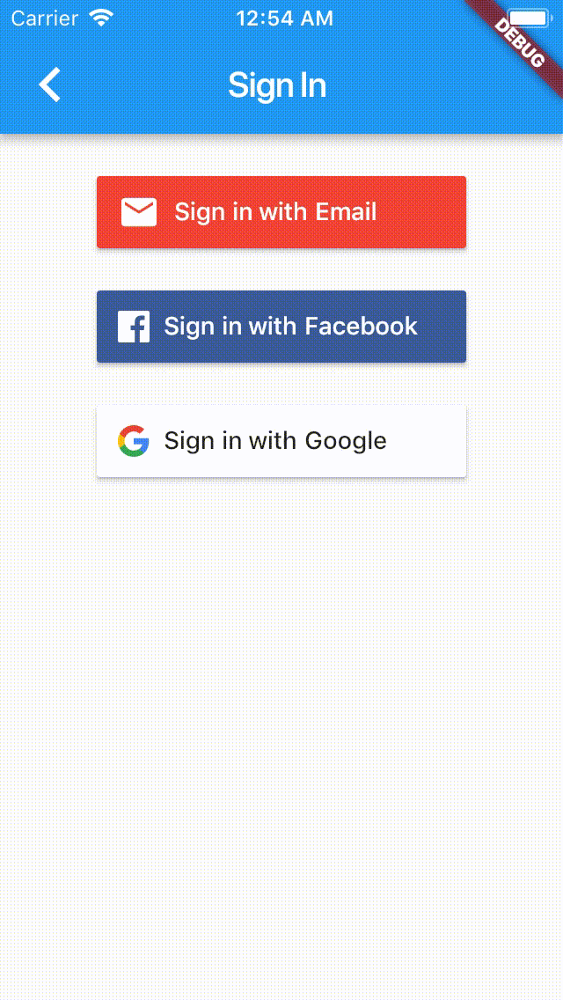

# fireauth_ui

[](https://www.bitrise.io/app/5200f74e30b34a48) 
[](https://pub.dartlang.org/packages/fireauth_ui)

Allows you to quickly connect common Firebase auth with basic UI.

| Sign in method    | Support           |
| ----------------- |:-----------------:|
| Email             | ✅                |
| Phone             | ❌                |
| Google            | ✅                |
| Play Games        | ❌                |
| Facebook          | ✅                |
| Twitter           | ❌                |
| Github            | ❌                |

Support language

- English

- Chinses (Tranditional)

Email sign in demo screen


## Installation

Add to your pubspec dependencies:
```yaml
fireauth_ui: ^0.0.1
```

Please follow below guides to setup.
1. [Setup facebook login](https://pub.dartlang.org/packages/flutter_facebook_login)
2. [Setup google login](https://pub.dartlang.org/packages/google_sign_in)
3. [Setup firebase Authentication](https://pub.dartlang.org/packages/firebase_auth)

## Getting Started

Add the following import to your Dart code:

```dart
import 'package:fireauth_ui/fireauth_ui.dart';
```

Sample code show you how to present sign in page
```dart
Navigator.push(
      context,
      new MaterialPageRoute(
          builder: (context) => new FireAuthUISignInPage(
                providers: [
                    FireAuthUIProvider.Email,
                    FireAuthUIProvider.Facebook,
                    FireAuthUIProvider.Google,
                ],
              )),
    );
```

## Dependencies

[flutter_facebook_login](https://pub.dartlang.org/packages/flutter_facebook_login)

[firebase_auth](https://pub.dartlang.org/packages/firebase_auth)

[google_sign_in](https://pub.dartlang.org/packages/google_sign_in)

License
-------

    Licensed under the Apache License, Version 2.0 (the "License");
    you may not use this file except in compliance with the License.
    You may obtain a copy of the License at

       http://www.apache.org/licenses/LICENSE-2.0

    Unless required by applicable law or agreed to in writing, software
    distributed under the License is distributed on an "AS IS" BASIS,
    WITHOUT WARRANTIES OR CONDITIONS OF ANY KIND, either express or implied.
    See the License for the specific language governing permissions and
    limitations under the License.